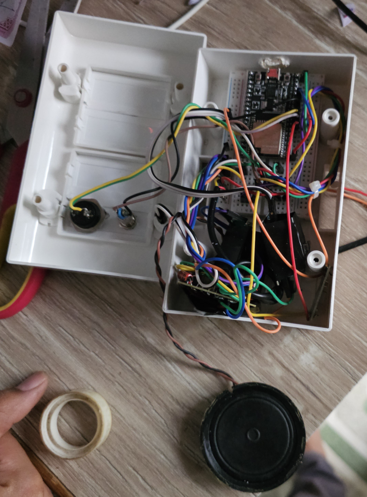
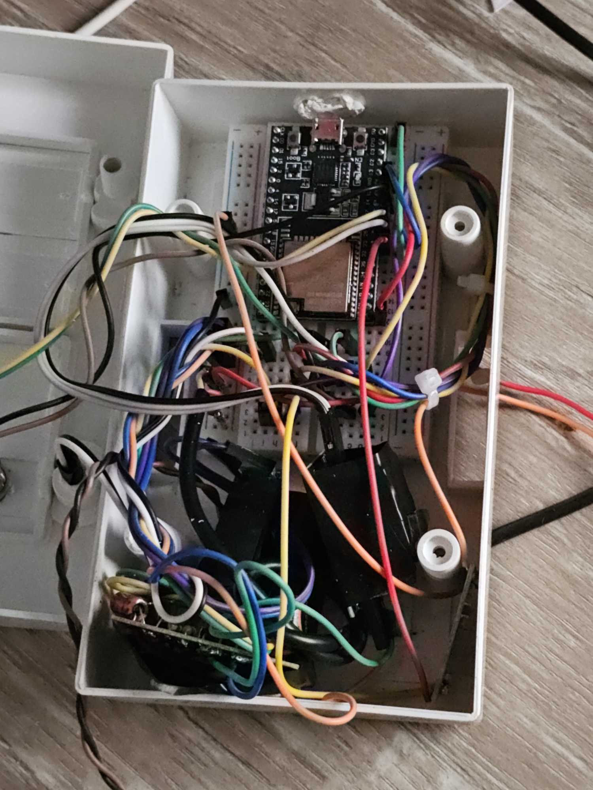
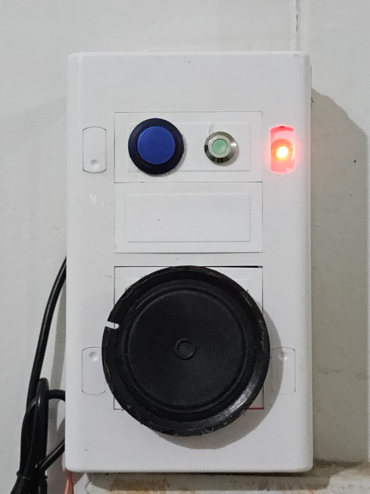

# Cloud Based Tap Water Monitoring using ESP32

This project is a municipal tap water alarming and monitoring system built using ESP32. It uses a sensor to detect the state of a water and records the tap water duration. The data is then sent to supabase using REST API that triggers aws lambda.

## Features

- Detects the state of a tap water using a sensor connected to GPIO pin 33 (detects the voltage change when the water arrives in the pipe)
- Records the start and end times of the tap water.
- Sends SMS alerts using Twilio to notify start and end time of the tap water.
- Sends the data (start time, end time, duration) to a supabase.
- Uses Blynk IoT for real-time control of esp32.
- Can be manually turned off using a button connected to GPIO pin 26.
- Uses an LED connected to GPIO pin 14 to indicate the state of the system.
- Android app for remote monitoring and control.
- Works with and without internet (no remote monitoring and control without internet).

## Technical details
- Uses freeRTOS threads for multitasking such as 
  - Connecting to WiFi
  - Establishing connection with Blynk and time server.
  - LED blinking when the system is running
- Utilising freeRTOS task queue for debouncing the sensor data.
- Using esp32 deep sleep mode to save power.
- Uses ISR to turn off the speakers using push button.

## Hardware

- ESP32-WROOM-32U
- 9v SMPS power supply
- 9v to 5v buck converter
- 9v to 3.3v buck converter
- 9v speaker for alarming
- Optical relay module connected to GPIO pin 25 to turn on/off the speaker
- Tap water sensor fitted in the pipe connected to GPIO pin 33
- Blinking LED connected to GPIO pin 14
- Push button connected to GPIO pin 26 for manually turning off the relay
- Breadboard for reusing the power pins of esp32.

## Software

- PlatformIO + VSCode
- Flutterflow for Android app
- Blynk IoT API that connects Android app to ESP32
- Supabase (Postgres) for storing the data
- API Gateway for triggering the lambda function
- Twilio for sending SMS alerts

