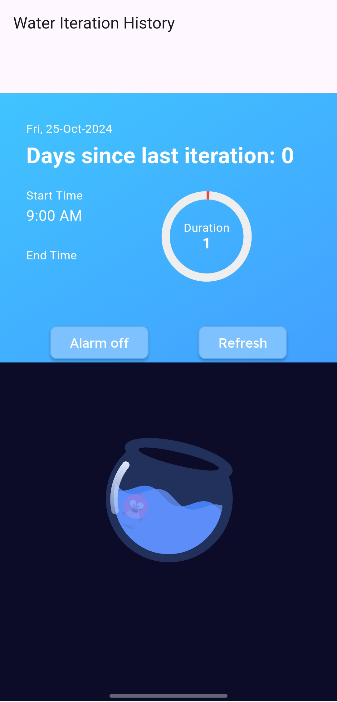
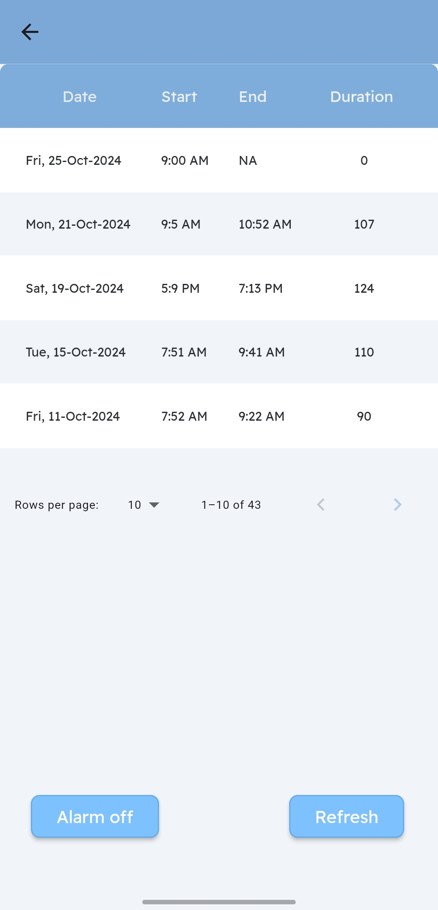
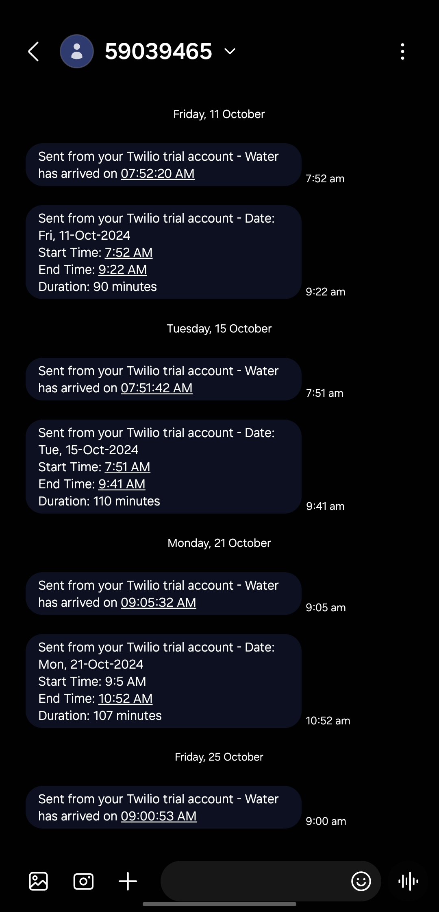
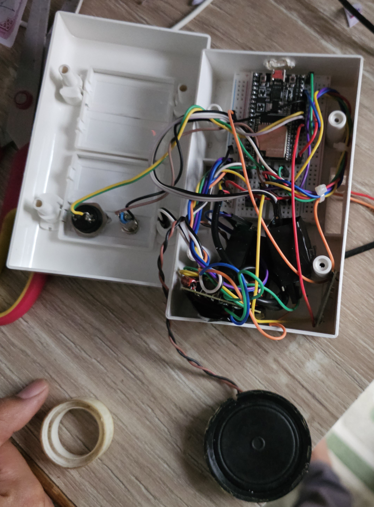
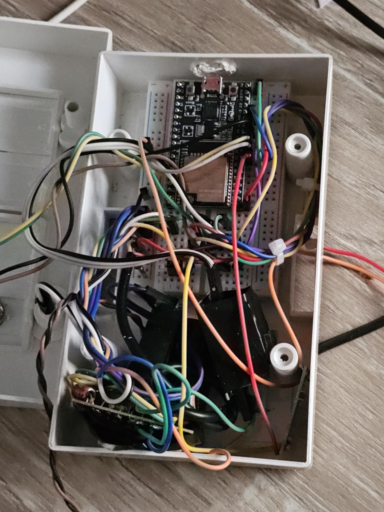
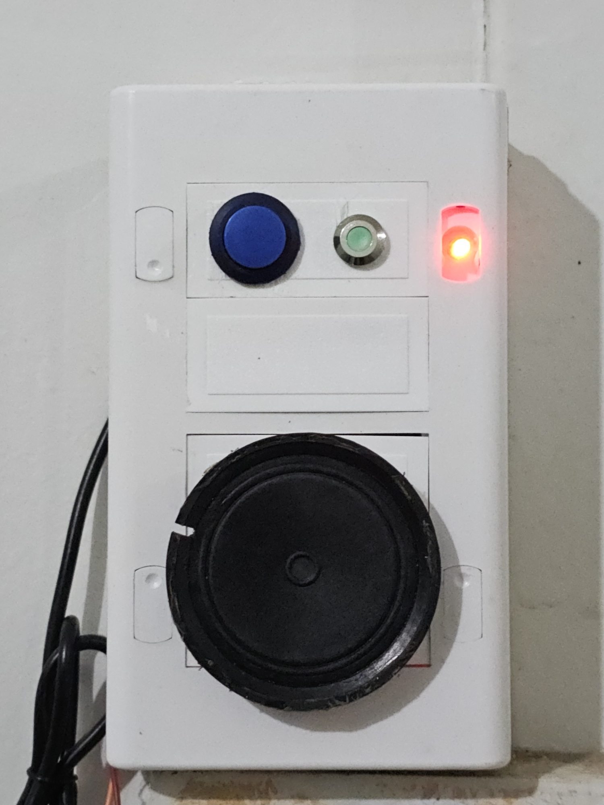

# Cloud Based Tap Water Monitoring using ESP32
The water-supply-monitor is an IoT-based municipal water monitoring system that automatically detects water availability, sends real-time alerts, and tracks supply patterns using ESP32 microcontroller, cloud infrastructure, and mobile applications.

## Features
- Detects the state of a tap water using a sensor connected to GPIO pin 33 (detects the voltage change when the water arrives in the pipe)
- Records the start and end times of the tap water.
- Sends SMS alerts using Twilio to notify start and end time of the tap water.
- Sends the data (start time, end time, duration) to a supabase.
- Uses Blynk IoT for real-time control of esp32.
- Can be manually turned off using a button connected to GPIO pin 26.
- Uses an LED connected to GPIO pin 14 to indicate the state of the system.
- Android app for remote monitoring and control.
- Works with and without internet (no remote monitoring and control without internet).

## Mobile App
### Demo Video
[Watch the app demo video](./artifacts/app_demo.mp4)

### App Screenshots

    
    

### SMS Notifications

## Technical details
- Uses freeRTOS threads for multitasking such as
  - Connecting to WiFi
  - Establishing connection with Blynk and time server.
  - LED blinking when the system is running
- Utilising freeRTOS task queue for debouncing the sensor data.
- Using esp32 deep sleep mode to save power.
- Uses ISR to turn off the speakers using push button.

## Hardware
- ESP32-WROOM-32U
- 9v SMPS power supply
- 9v to 5v buck converter
- 9v to 3.3v buck converter
- 9v speaker for alarming
- Optical relay module connected to GPIO pin 25 to turn on/off the speaker
- Tap water sensor fitted in the pipe connected to GPIO pin 33
- Blinking LED connected to GPIO pin 14
- Push button connected to GPIO pin 26 for manually turning off the relay
- Breadboard for reusing the power pins of esp32.

## Hardware Setup Photos

    
    
    

## Software
- PlatformIO + VSCode
- Flutterflow for Android app
- Blynk IoT API that connects Android app to ESP32
- Supabase (Postgres) for storing the data
- API Gateway for triggering the lambda function
- Twilio for sending SMS alerts
